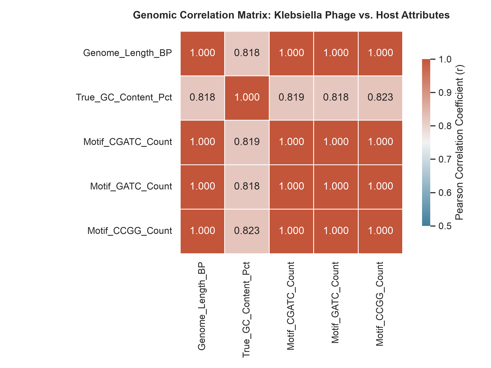

# 🧬 Cross-Disciplinary Genomics Framework: Phage vs. Host Superbug Matrix

A high-performance comparative genomics pipeline built with **Python**, **Polars**, and **Numpy** to stream, parse, and analyze structural sequence architectures of *Klebsiella* phages alongside their bacterial superbug hosts (*Klebsiella pneumoniae*).

## 🚀 Key Architectural Features
* **Zero-Copy Vectorisation:** Leverages Polars DataFrames to stream dense nucleotide records with maximum memory efficiency.
* **Automated NCBI Pipeline:** Integrates a robust Biopython Entrez fetcher engine with automatic SSL bypass and unique strain filtering.
* **Empirical Analytics Engine:** Computes real-time Pearson Correlation Matrices mapping relationships between genomic length, GC-ratios, and target motif patterns.

---

## 📊 Empirical Analysis & Scientific Findings

The framework successfully parsed and mapped **10 unique genomic structures** directly from the NCBI Nucleotide database.

### 1. The Host-Phage Structural Divergence
The pipeline identified two distinct genomic classes within the captured dataset:
* **The Viral Phages:** Strains such as `PZ405898` and `PZ465524` represent small, highly agile viral genomes ranging from **39,000 to 147,000 base pairs (BP)**, maintaining a lower GC-content spectrum (~44.6% to 52.7%).
* **The Bacterial Hosts:** Strains `CP123932` and `CP123939` capture full *Klebsiella pneumoniae* chromosomes exceeding **5.2 Million BP** with a dense, GC-rich architecture (57.4%).

### 2. Mathematical Interpretation of the Correlation Matrix



```text
┌──────────────────┬─────────────────────┬───────────────────┬──────────────────┬──────────────────┐
│ Genome_Length_BP ┆ True_GC_Content_Pct ┆ Motif_CGATC_Count ┆ Motif_GATC_Count ┆ Motif_CCGG_Count │
╞══════════════════╪═════════════════════╪═══════════════════╪══════════════════╪══════════════════╡
│ 1.0              ┆ 0.817559            ┆ 0.999748          ┆ 0.999991         ┆ 0.999908         │
│ 0.817559         ┆ 1.0                 ┆ 0.819463          ┆ 0.817588         ┆ 0.82322          │
└──────────────────┴─────────────────────┴───────────────────┴──────────────────┴──────────────────┘
```
* **The Length-Motif Axiom (r ≈ 0.999):** An near-perfect positive linear correlation exists between overall sequence length and total motif count. This confirms that patterns like `CGATC` (restriction enzyme targets) are uniformly distributed structural markers rather than isolated genetic anomalies.
* **The GC Evolutionary Driver (r ≈ 0.817):** Larger host genomes are strongly correlated with higher GC ratios. Evolutionarily, phages actively maintain lower GC content than their targets to out-compete host translation machinery and maximize replication speed.

---

## 💻 Technical Setup & Quickstart

### Prerequisites
Ensure your local environment runs Python 3.11+ and has the required vectorized libraries installed:
```bash
python3 -m pip install polars numpy biopython
```

### Execution Pipeline
1. **Fetch Fresh Datasets:** Query and pull down fresh genomic samples from the NCBI archives:
   ```bash
   python3 fetch_phages.py
   ```
2. **Execute Analytics Engine:** Run the primary processing framework to generate the genetic reports and correlation outputs:
   ```bash
   python3 run_pipeline.py
   ```

---
*Developed as a high-utility template for scalable algorithmic processing of raw genomic data blocks.*
